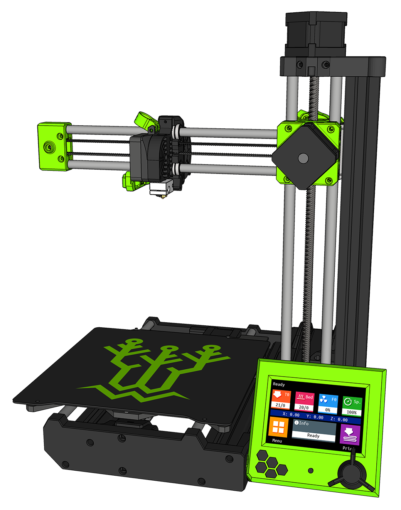

# Marlin Firmware for DIY Prusa Mini / SKR Mini E3 V2

## Specs

This firmware is configured for a DIY Prusa Mini powered by a BigTreeTech SKR Mini E3 V2:

### Frame
* [Black Prusa Mini Color Conversion Kit](https://www.oem3d.com/collections/frame-upgrades/products/color-conversion-kit-for-the-original-prusa-mini)
* [Prusa Mini hardware kit](https://www.aliexpress.com/item/4000890292698.html)

### Motherboard
* [BigTreeTech SKR Mini E3 V2](https://www.biqu.equipment/collections/skr-series/products/bigtreetech-skr-mini-e3-v2-0-32-bit-control-board-integrated-tmc2209-uart-for-ender-3)
* Modded Prusa Mini control box

### Power
* [MEAN WELL 24V 160W 6.67A GST160A24-R7B desktop AC->DC power adapter](https://www.mouser.com/_/?Keyword=GST160A24-R7B&bws=1)
* [Kycon KPJX-PM-4S DC power connector](https://www.mouser.com/_/?Keyword=KPJX-PM-4S&bws=1)

### Hotend / Extruder
 * [Prusa Mini heatsink](https://shop.prusa3d.com/en/mini/1174-hotend-heatsink-mini.html)
 * [Prusa Mini heaterblock](https://shop.prusa3d.com/en/mini/1171-hotend-heaterblock-mini.html)
 * [Bondtech Prusa Mini heatbreak](https://www.bondtech.se/en/product/bondtech-heat-break-for-prusa-mini/)
* [Bondtech Prusa Mini extruder](https://www.bondtech.se/en/product/prusa-mini/)
 * [Prusa Mini PTFE](https://shop.prusa3d.com/en/mini/1067-extruder-print-head-ptfe-tube-mini.html)
 * [Mechatronics G4010L24B-RSR 24v 40mm fan](https://www.digikey.com/product-detail/en/G4010L24B-RSR/1570-G4010L24B-RSR-ND/11492597) (hotend cooling)
 * [Mechatronics B5015E24B-BSR 24v 5015 fan](https://www.digikey.com/product-detail/en/mechatronics-fan-group/B5015E24B-BSR/1570-1034-ND/5209731) (parts cooling)
 * [SuperPINDA probe](https://shop.prusa3d.com/en/spare-parts/1396-superpinda.html)

### Bed
* [BigTreeTech Prusa Mini bed with SSS "Super Spring Steel" Plate](https://www.biqu.equipment/products/magnetic-heatbed-steel-sheet-202x186x2mm-24v-for-prusa-mini-3d-printer-hotbed-heated-bed-3d-printer-parts)

### LCD Controller
* [BigTreeTech TFT35 E3 V3](https://www.biqu.equipment/collections/lcd/products/btt-tft35-e3-v3-0-display-touch-screen-two-working-modes)
* Modded "Prusa Mini Ender LCD Remix" mount

### Steppers
* **X-axis:** [LDO COOLER LDO-42STH40-1004ASR](https://www.printedsolid.com/products/ldo-nema-17-motor-cooler-ldo-42sth40-1004asr) 1.8°
* **Y-axis:** [LDO COOLER LDO-42STH40-1004ASR](https://www.printedsolid.com/products/ldo-nema-17-motor-cooler-ldo-42sth40-1004asr) 1.8°
* **Z-axis:** [LDO LDO-42STH34-1004L321EC](https://www.printedsolid.com/products/ldo-nema-17-motor-mk3-z-motor-qlink-ldo-42sth34-1004l321ec) 1.8° w/ integrated leadscrew
* **Extruder:** [LDO SLIM POWER LDO-42STH25-1404MAC](https://www.printedsolid.com/products/ldo-nema-17-motor-pancake-ldo-42sth25-1404) 0.9°

### Other
* Genuine Gates 2GT PowerGrip belts
* Genuine Gates 2GT PowerGrip 16 tooth idlers & pulleys
